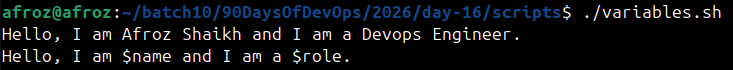
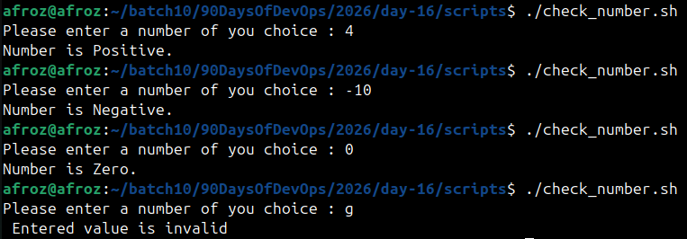

# Shell Scripting Basics

## Task 1: First Script
1. Create a file `hello.sh`
2. Add the shebang line `#!/bin/bash` at the top
3. Print `Hello, DevOps!` using `echo`
4. Make it executable and run it

[Here is the script hello.sh](scripts/hello.sh)

* What happens if you remove the shebang line?
 - The script runs after removing shebang line :
    - `./hello.sh` - Kernel looks for a shebang if not found it will use current shell to interpret the file.
    - `bash hello.sh` - The shell explicitly uses bash.
    - `sh hello.sh` - It uses sh.

---

## Task 2: Variables
1. Create `variables.sh` with:
   - A variable for your `NAME`
   - A variable for your `ROLE` (e.g., "DevOps Engineer")
   - Print: `Hello, I am <NAME> and I am a <ROLE>`
2. Try using single quotes vs double quotes — what's the difference?
 * Using double quote `" "` - The variables and commands are evaluated.
 * Using single quote `' '` - Everything inside is taken literally, no evaluation happens.

[Here is the script variables.sh](scripts/variables.sh)

---

## Task 3: User Input with read
1. Create `greet.sh` that:
   - Asks the user for their name using `read`
   - Asks for their favourite tool
   - Prints: `Hello <name>, your favourite tool is <tool>`

[Here is the script greet.sh](scripts/greet.sh)

---

## Task 4: If-Else Conditions
1. Create `check_number.sh` that:
   - Takes a number using `read`
   - Prints whether it is **positive**, **negative**, or **zero**

[Here is the script check_number.sh](scripts/check_number.sh)

2. Create `file_check.sh` that:
   - Asks for a filename
   - Checks if the file **exists** using `-f`
   - Prints appropriate message

[Here is the script file_check.sh](scripts/file_check.sh)

---

## Task 5: Combine It All
Create `server_check.sh` that:
1. Stores a service name in a variable (e.g., `nginx`, `sshd`)
2. Asks the user: "Do you want to check the status? (y/n)"
3. If `y` — runs `systemctl status <service>` and prints whether it's **active** or **not**
4. If `n` — prints "Skipped."

[Here is the script server_check.sh](scripts/server_check.sh)

## What I learned -

* How to write and run shell scripts with shebangs, variables, and user input using read.
* The difference between single vs double quotes, and how quoting affects variable expansion.
* Using conditional logic (if, elif, else) and test operators (-f, -gt, -lt) to handle files and numbers.
* Error redirection (>/dev/null, 2>/dev/null, &>/dev/null).

